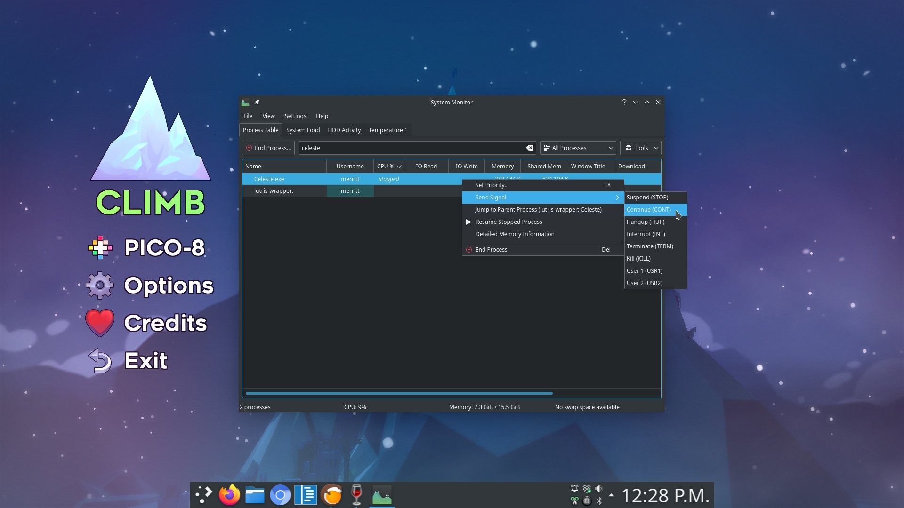

# Nyrna

**Nyrna allows the user to pause any game or application on their PC.**

The reason for this project is to have a function on PC similar to the incredibly useful sleep/suspend function found in consoles like the Nintendo Switch and Sony PlayStation; suspend your game (and its resource usage) at any time, and resume whenever you wish - at the push of a button.

That said this can be used to pause normal, non-game applications as well. For example: while doing a long 3D render, or maybe a video encoding job, the CPU and GPU resources are being hogged by said task - maybe for hours - when you would like to use the system for something else. With Nyrna you can pause that program, freeing up the CPU and GPU resources (not RAM) until the process is resumed, without losing where you were.

Nyrna works on Linux with X11 and Microsoft Windows (tested on Windows 10).

# Installing

### Arch / Manjaro

A package is available [in the AUR](https://aur.archlinux.org/packages/nyrna/).

- `yay nyrna`

### Gentoo

A package is available as [nyrna](https://github.com/BlueManCZ/edgets/tree/master/x11-misc/nyrna) or [nyrna-bin](https://github.com/BlueManCZ/edgets/tree/master/x11-misc/nyrna-bin) in the [edgets overlay](https://github.com/BlueManCZ/edgets).

- `layman --add edgets && emerge --ask nyrna`

### Portable version (Linux / Windows)

_Linux Requirements_:

- `libappindicator3`
- `gtk+3.0`
- `zenity`

_Example_:

- Debian / Ubuntu: `sudo apt install libappindicator3-1 gtk+3.0 zenity`

_Setup portable version_:

- Download Nyrna:
  - [Linux](https://github.com/Merrit/nyrna/releases/latest/download/nyrna)
  - [Windows](https://github.com/Merrit/nyrna/releases/latest/download/nyrna.exe)
- Place wherever you would like the application to live (eg: ~/Applications)
- _Linux only:_ Make sure it is set as executable
- Click to run - it will run in your system tray.

# Usage

- Press the `Pause` key on your keyboard to suspend the active, foreground application. Press again to resume the same application regardless of the current focus.

- To change the hotkey: Right click tray icon -> `Change Hotkey`

# Disclaimer

I have not had any issues using Nyrna, however keep in mind it is possible something could go wrong with a suspend. So please remember to always save your work and games.

# In case of issue

I haven't seen this issue, however if at any time the hotkey isn't working to resume, you can always manually find your process in task manager and resume or send signal SIGCONT / CONT:

# Planned Features

- ~~Run in system tray with hotkey configured by app~~ :heavy_check_mark:
- ~~Package(s) for ease of use~~ :heavy_check_mark:
  - ~~Portable executable~~ :heavy_check_mark:
  - ~~Arch User Repository~~ :heavy_check_mark:
- ~~Simple way to customize hotkey~~ :heavy_check_mark:
- ~~Windows support~~ :heavy_check_mark:

# FAQ

**Can I suspend to disk so that I can restore after reboot / free up RAM usage / etc?**

Unfortunately no. CRUI looks very promising to allow us to do this (on linux), however it [does not currently support suspending GUI applications](https://criu.org/X_applications).
