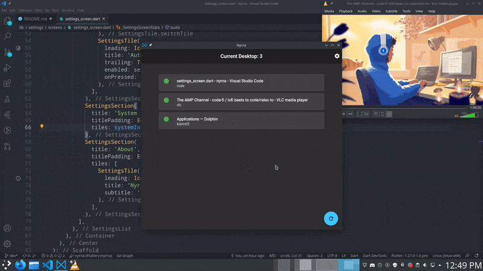

_Nyrna is being rewritten from scratch in Dart / Flutter._

_Currently only a Linux version is available as alpha._

# Nyrna

**Suspend games and applications.**

Similar to the incredibly useful sleep/suspend function found in consoles like the Nintendo Switch and Sony PlayStation; suspend your game (and its resource usage) at any time, and resume whenever you wish - at the push of a button.

Nyrna can be used to suspend normal, non-game applications as well. For example:

- 3D renders
- video encoding
- software compilation

The CPU and GPU resources are being used by said task - maybe for hours - when
you would like to use the system for something else. With Nyrna you can suspend
that program,
freeing up the resources (excluding RAM) until the process is resumed,
without losing where you were - like the middle of a long job, or a gaming session
between save points.

Nyrna works on Linux with X11 and Microsoft Windows (tested on Windows 10).

# Installing

<!-- 
// Commented out until packaging for 2.0 is clarified.

## Linux

### Arch / Manjaro

A package is available [in the AUR](https://aur.archlinux.org/packages/nyrna/).

- `yay nyrna`

### Gentoo

A package is available as [nyrna](https://github.com/BlueManCZ/edgets/tree/master/x11-misc/nyrna) or [nyrna-bin](https://github.com/BlueManCZ/edgets/tree/master/x11-misc/nyrna-bin) in the [edgets overlay](https://github.com/BlueManCZ/edgets).

- `layman --add edgets && emerge --ask nyrna`

## Microsoft Windows

Available in the [Chocolatey Community Packages repository.](https://chocolatey.org/packages/nyrna)

-   `choco install nyrna`
-->

## Portable version

_Requirements_:

<!-- - `libappindicator3`
- `gtk+3.0`
- `zenity` -->

- wmctrl
- xdotool

_Example_:

- Debian / Ubuntu: `sudo apt install wmctrl xdotool`
- Arch / Manjaro: `sudo pacman -S wmctrl xdotool`

_Setup portable version_:

- Download [Nyrna](https://github.com/Merrit/nyrna/releases/latest/download/nyrna.tar.gz)
  <!-- - [Linux](https://github.com/Merrit/nyrna/releases/latest/download/nyrna)
  - [Windows](https://github.com/Merrit/nyrna/releases/latest/download/nyrna.exe) -->
- Extract and place the Nyrna folder wherever you would like the application to live (eg: ~/Applications)
- Ensure that the `nyrna` file is set as executable
- Start the `nyrna` file to run the program

_Optional:_

In settings is a button to add Nyrna to the system launcher.

# Usage

Click the tile for the application you wish to suspend / resume.

**Advanced:**

Alternatively you can set a custom shortcut to launch Nyrna with the `--toggle`
or `-t` flag, then toggle the suspend state of the active window by pressing
that shortcut. (This currently does not work consistently if Nyrna is already open)

# Disclaimer

I have not had any issues using Nyrna, however keep in mind it is possible
something could go wrong with an application while suspended. So please remember to always save
your work and games.

# FAQ

**Can I suspend to disk so that I can restore after reboot / free up RAM usage / etc?**

Unfortunately no. [CRIU](https://criu.org/) looks very promising to allow us to do this (on Linux), however it [does not currently support suspending GUI applications](https://criu.org/X_applications).
