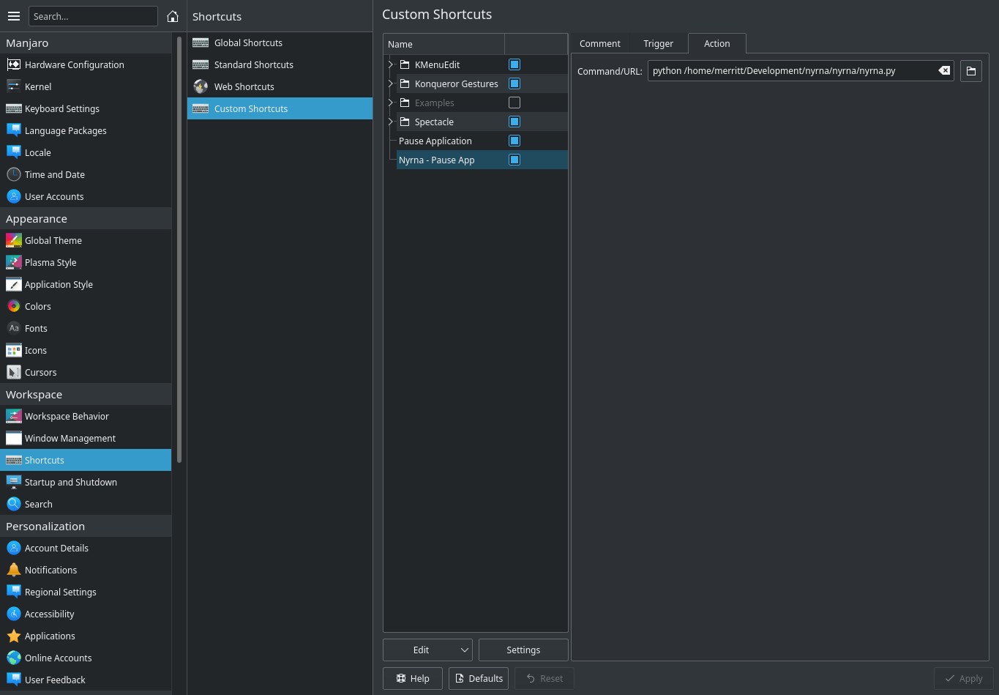

# Nyrna

**Nyrna allows the user to pause any game or application on their PC.**

The reason for this project is to have a function on PC similar to the incredibly useful sleep/suspend function found in consoles like the Nintendo Switch and Sony PlayStation; suspend your game (and its resource usage) at any time, and resume whenever you wish - at the push of a button.

That said this can be used to pause normal, non-game applications as well. For example: while doing a long 3D render, or maybe a video encoding job, the CPU and GPU resources are being hogged by said task - maybe for hours - when you would like to use the system for something else. With Nyrna you can pause that program, freeing up the CPU and GPU resources (not RAM) until the process is resumed, without losing where you were.

Nyrna currently works on Linux. Windows support is in progress.

# Prerequisites

- Python 3
  - psutil (pip install psutil)
  - PyGObject (pip install PyGObject)

# Usage

Download `nyrna.py`, ensure it is set as executable and create a custom shortcut to it so that it can triggered with a hotkey.

Example on KDE:  
System Settings -> Shortcuts -> Custom Shortcuts  
Edit -> New -> Global Shortcut -> Command/URL  
Trigger: Choose a hotkey (eg, Pause)  
Action: `python /path/to/nyrna.py`

When you press the hotkey it will toggle suspend/resume on the program with the active window. This is currently only tested to work with **_one application at a time_**, so using it with multiple apps might not work as expected. This is especially true for Wine games using an emulated desktop - you likely won't be able to resume that Wine game if you have paused something else afterwards.

# Disclaimer

I have not had any issues using Nyrna, however keep in mind it is possible something could go wrong with a suspend. So please remember to always save your work and games.

# In case of issue

I haven't seen this issue, however if at any time the hotkey isn't working to resume, you can always manually find your process in task manager and resume or send signal SIGCONT / CONT:

# Planned Features

- Windows support
- Run in system tray with hotkey configured by app
