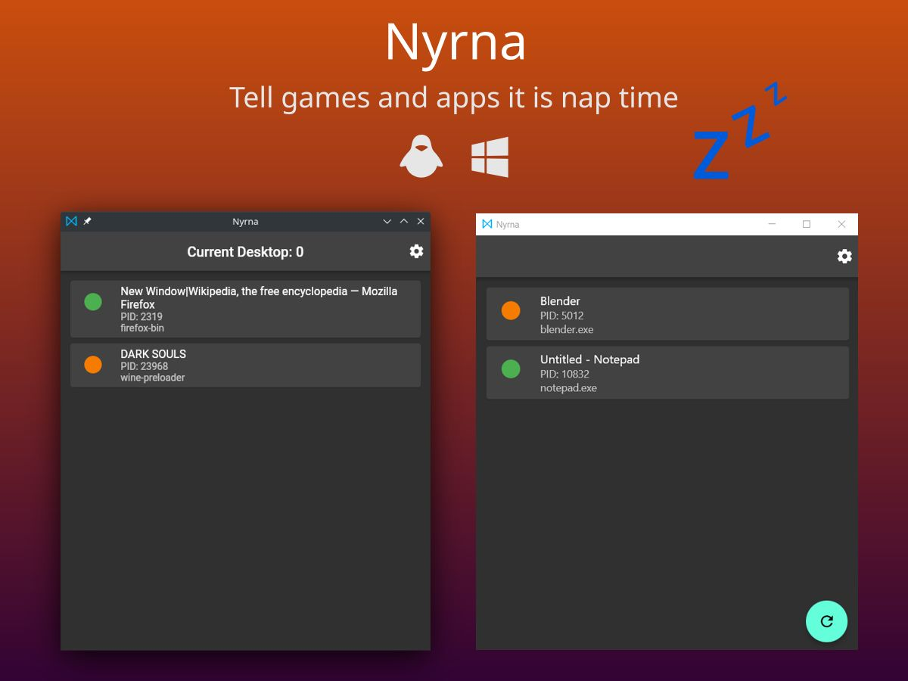

# Nyrna

**Suspend games and applications.**

Similar to the incredibly useful sleep/suspend function found in consoles like the Nintendo Switch and Sony PlayStation; suspend your game (and its resource usage) at any time, and resume whenever you wish - at the push of a button.

## Suspend Games

- Pause cutscenes to read the subtitles, examine the scene, answer the door, etc.
- Pause games that can't normally be paused (single-player games like Dark Souls, Elden
  Ring, etc)
- Suspend games whose pause screens keep the system running hot or playing
  unwanted music
- Suspend inbetween checkpoints (example: Hollow Knight)

## Suspend Applications

Nyrna can be used to suspend normal, non-game applications as well. For example:

- 3D renders
- video encoding
- software compilation

The CPU and GPU resources are being used by said task - maybe for hours - when
you would like to use the system for something else. With Nyrna you can suspend
that program,
freeing up the resources (excluding RAM) until the process is resumed,
without losing where you were - like the middle of a long job, or a gaming session
between save points.

---

Nyrna works on Linux with X11 and Microsoft Windows.

[Nyrna Website](https://nyrna.merritt.codes)

## Disclaimer

Modifying running applications comes with the possibility that the application will crash.

While this is rare, it is a known possibility that Nyrna can do nothing about.

Please make sure to **save** your data or game before attempting to use Nyrna.

## Install

View install options on the [website](https://nyrna.merritt.codes/download).

## FAQ

**Can I suspend to disk so that I can restore after reboot / free up RAM usage / etc?**

Unfortunately no. [CRIU](https://criu.org/) looks very promising to allow us to do this (on Linux), however it [does not currently support suspending GUI applications](https://criu.org/X_applications).

## Building

See [BUILDING](BUILDING.md)
