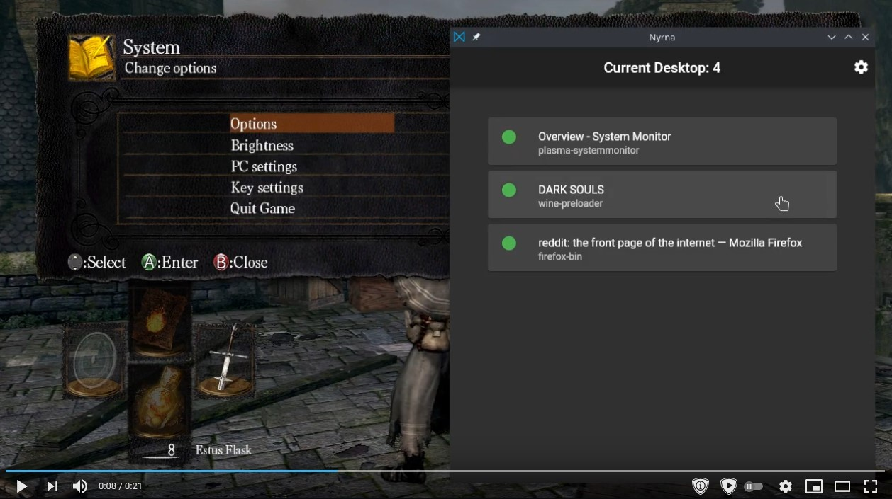
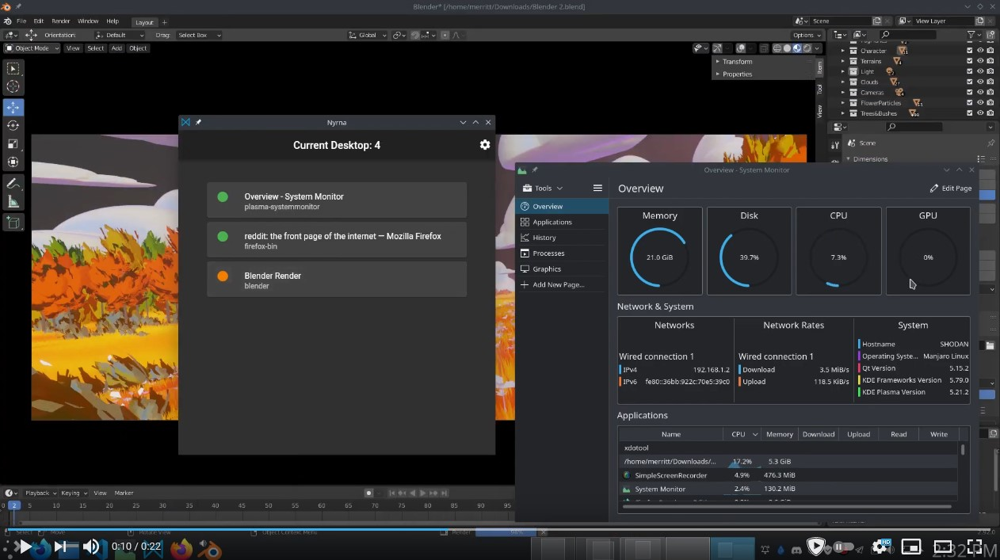
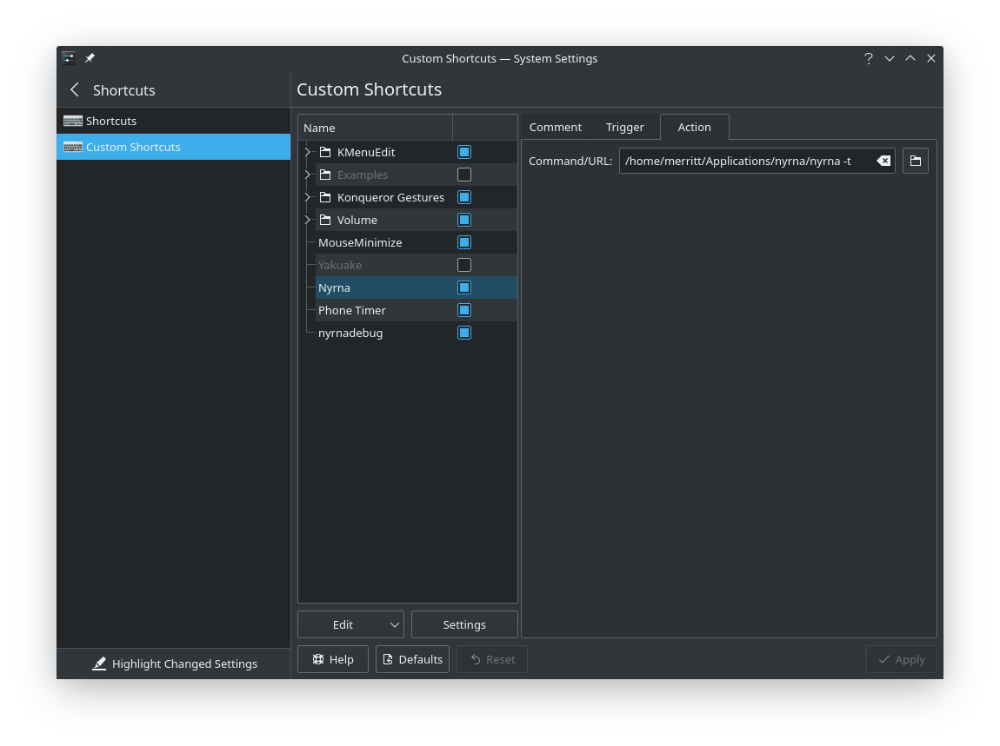

 

# Video examples

## Games

**Dark Souls**  
*No pause feature? What if I need to answer the phone?*  

 

## Applications

**Blender**  
*Time for my Zoom meeting and my system is bogged down with a render..*  

 

# Advanced

## Toggle active window

Nyrna can be used to toggle the suspend / resume state of one active window:

- Linux
  - Set a hotkey in system settings to run the `nyrna_toggle_active_window` executable
    from the Nyrna directory

- Windows
  - Run the `toggle_active_hotkey.exe` file from the Nyrna directory to add an
    icon to the system tray that will listen for the `Pause` key to be pressed.
    - Optionally, from Nyrna's settings you can set this hotkey monitor to run
      automatically at boot.

Now simply press the hotkey on your keyboard to have the window of your
currently active application suspended. A subsequent press will resume that
application.

**Tip:** You can use something like
[AntiMicro](https://github.com/AntiMicro/antimicro) to trigger this hotkey with
your gamepad, allowing you to suspend/resume your game with just your controller.

**Linux Example**


- Shortcuts ->
- Custom Shortcuts ->
  - Edit ->
    - New ->
      - Global Shortcut
        - Action: `/path/to/nyrna/nyrna_toggle_active_window`



  <h4 class="no_toc">KDE System Settings:</h4>
  {{ linux-example-text | markdownify }}

